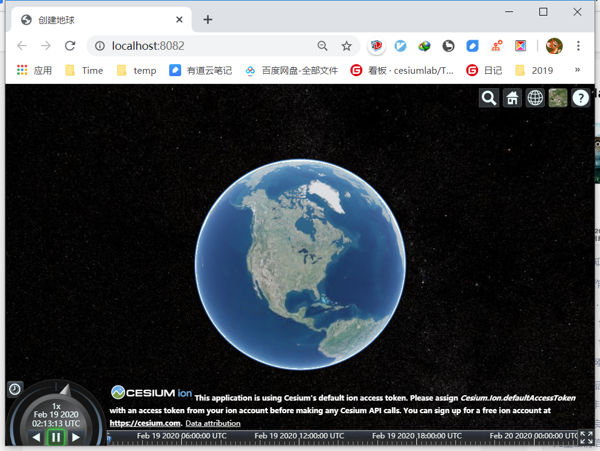

# 基于Cesium创建的极简App

## 简介

基于webpack，创建一个简单的基于Cesium的App，可以进行调试和打包。

没有使用vue，主要是说明如何通过webpack来引用Cesium，和打包js代码的方法。

这里使用npm install cesium的方式来引入Cesium，方便版本更新。

## 使用方法

0. 安装
npm install

1. 调试
npm run dev

2. 打包
npm run build

## 使用VUE

如果需要使用Vue的话，可以参考这个项目：https://github.com/cesiumlab/EarthSDK-vue-cli-app 

这个项目并非为Cesium准备，但是内部可以配置成纯Cesium+Vue开发的项目，具体请查看该项目说明。

